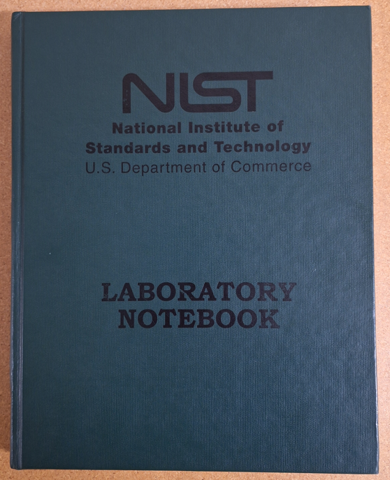
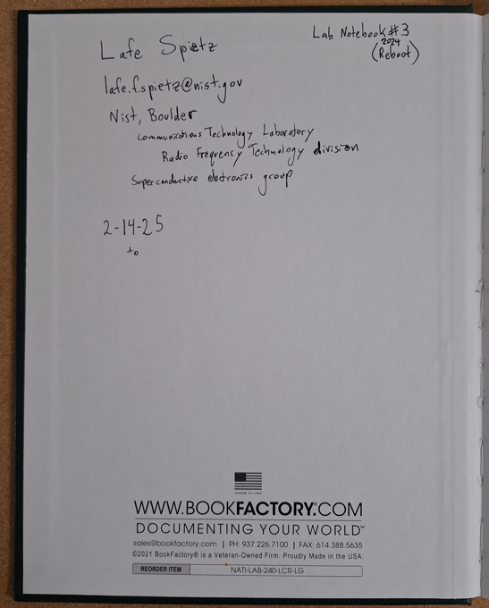

# [Lab Notebook Number Three](https://github.com/lafefspietz/lab-notebook-number-three)
  
  
  
  
  
   - [index.html](index.html)
   - [thing.txt](thing.txt)
   - [http://localhost/lab-notebook-number-three/](http://localhost/lab-notebook-number-three/)
   - [edit-html.html](edit-html.html)
   - [edit-index.html](edit-index.html)
   - [edit-php.html](edit-php.html)
   - [qrcode.html](qrcode.html)
   - [global replicator link](https://raw.githubusercontent.com/lafefspietz/lab-notebook-number-three/refs/heads/main/php/replicator.txt)
  

## thing.txt

```
{
    "name": "Lab Notebook #3 (2024 reboot)",
    "location": "NIST Boulder, building 1, room 2111",
    "description": "Green hard cover bound notebook with NIST logo, used for daily record of Lafe Spietz's work at NIST in flux quantum electronics project in Volt group in the RF technoloogy division of the communications technology laboratory at the National Institute of Standards and Technology in Boulder, Colorado",
    "contact": "cell phone: (303)817-8283 email: lafe.f.spietz@nist.gov",
    "message": "if found, please return",
    "url": "https://github.com/lafefspietz/lab-notebook-number-three/"
}
```